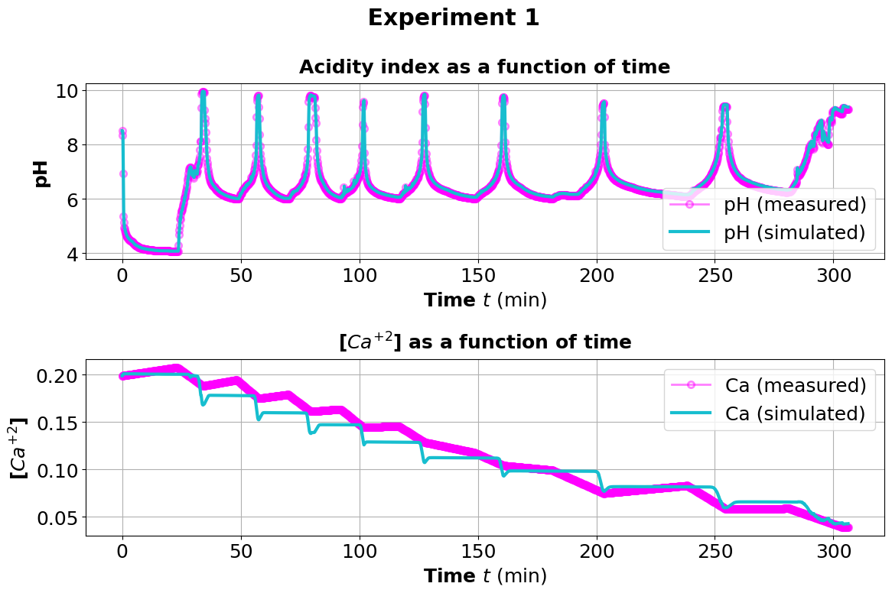
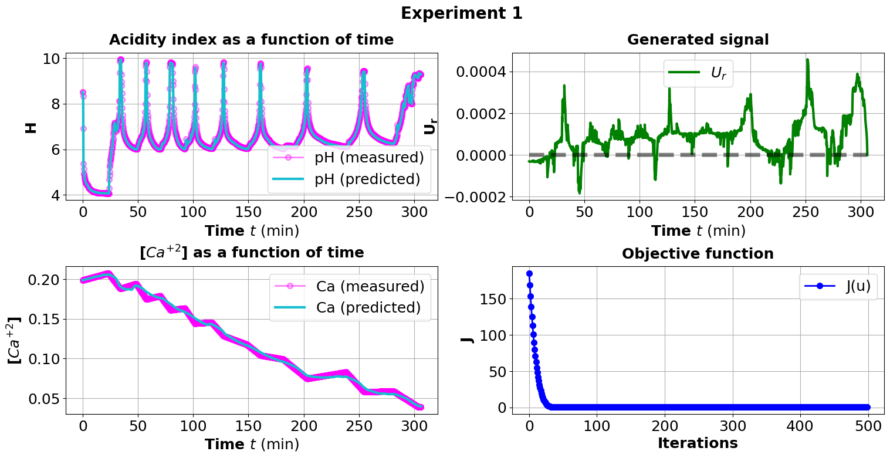
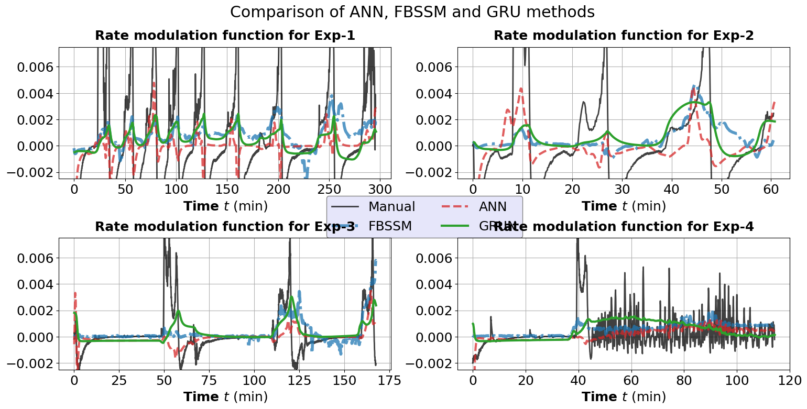

# Modeling and Design of pH based Precipitation Process

This repository contains the code and data for the project **Mathematical modeling of a pH Swing Precipitation Process and its Optimal Design.** 

## Overview

The goal of this work is to model and generate precipitation patterns using stochastic and diffusion-based approaches. The methods implemented here allow for the simulation, analysis, and visualization of complex precipitation phenomena.

## Features

- Simulation of precipitation patterns using DFGSPP.
- Tools for analyzing spatial and temporal characteristics.
- Visualization utilities for generated and real-world data.

## Code Structure

The repository is organized as follows:

```
precip_design/
├── data/                # Input datasets and real-world precipitation data
├── figures/             # Output figures, sample results, and comparisons
├── src/                 # Python code FBSDE and DNN methods along with helper utilities
├── requirements.txt     # Python dependencies
├── run_dnn.sh           # Script file to run the dnn based optimal precip design method
├── run_fbsde.sh         # Script file to run the FBSDE method for optimal precip design
├── runner.sh            # Wrapper file the runs all the methods and generates plots
└── README.md            # Project documentation
```
## Disclaimer

Some folders such as `data/` and `src/` are left empty or contain limited content, as the full code and datasets are not publicly released while the work is under peer-review.
## Usage

### 1. Clone the repository

```bash
git clone https://github.com/yourusername/precip_design.git
cd precip_design
mkdir -p data models results/precip_design
```

### 2. Install dependencies

```bash
conda create -n precip python=3.10.16
conda activate precip
pip install -r requirements.txt
```

### 3. Run the main simulation
```bash
./runner.sh
```

## Sample Results

Below are sample results of the function $U_r$ generated using various different methods


*Figure 1: U_r generated manually.*


*Figure 2: U_r generated using FBSDE method.*


*Figure 3: U_r generated via ANN model.*


*Figure 4: U_r generated via GRU model.*



*Figure 5: Comparison between the generated $U_r$ via above different methods.*

## License

This project is licensed under the MIT License. See the [LICENSE](LICENSE) file for details.

## Citation

If you use this work in your research, please cite:

```
@article{precip_design_2025,
    title={Mathematical modeling of a pH Swing Precipitation Process and its Optimal Design},
    author={Sandesh Athni Hiremath, Chinmay Hegde and Andreas Voigt},
    journal={arXiv preprint arXiv:XXXX.XXXXX},
    year={2025}
}
```

For more details, see the [arXiv preprint](https://arxiv.org/abs/XXXX.XXXXX).
