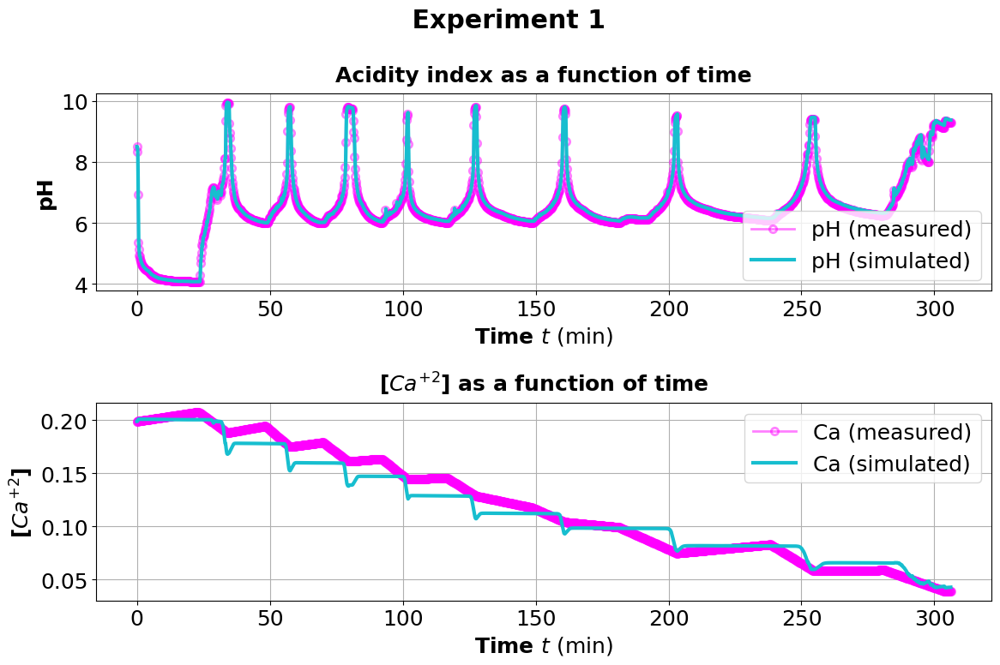
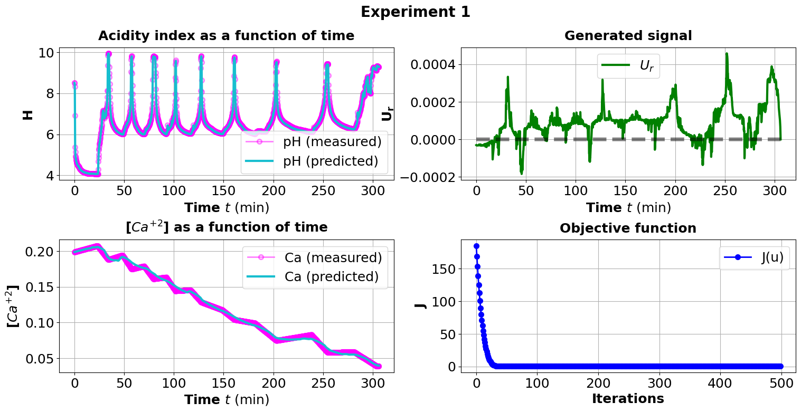
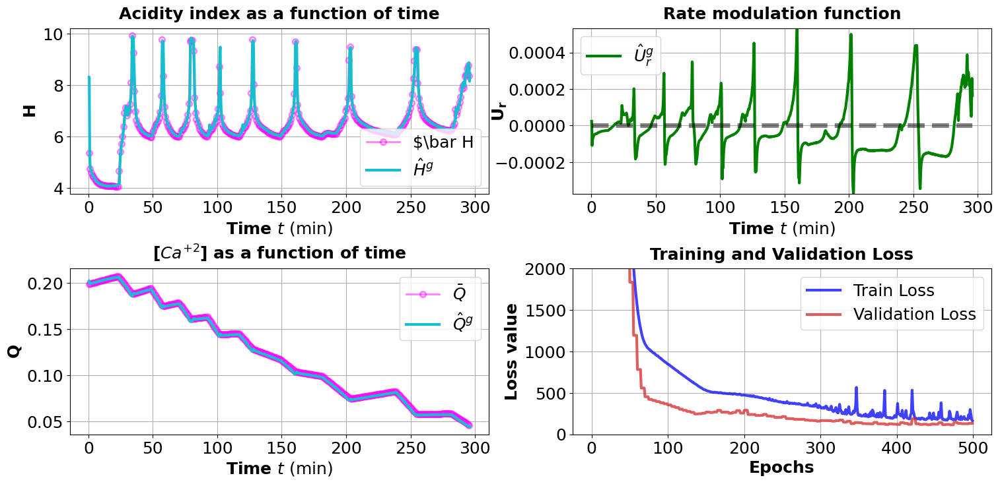
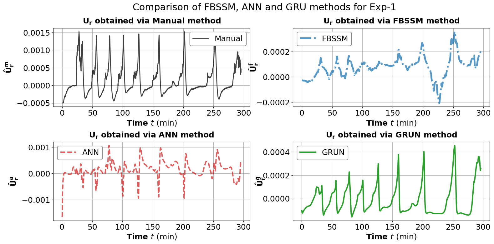

# Modeling and Design of pH based Precipitation Process

This repository contains the code and data for the project **Mathematical modeling of a pH Swing Precipitation Process and its Optimal Design.** 

## Overview

The goal of this work is to model and simulate the pH swing precipitation process using stochastic and partial differential equations. The methods implemented here allow for the simulation, analysis, and visualization of complex precipitation phenomena.

## Features

- Simulation of the pH swing precipitation process.
- Visualization plots for generated for lab-scale data.

## Code Structure

The repository is organized as follows:

```
precip_design/
├── data/                # Input datasets and real-world precipitation data
├── results/             # Output figures, sample results, and comparisons
├── src/                 # Python code FBSDE and DNN methods along with helper utilities
├── requirements.txt     # Python dependencies
├── run_dnn.sh           # Script file to run the dnn based optimal precip design method
├── run_fbsde.sh         # Script file to run the FBSDE method for optimal precip design
├── runner.sh            # Wrapper file that runs all the methods and generates plots
└── README.md            # Project information and usage instructions
```

## Usage

### 1. Clone the repository

```bash
git clone https://github.com/yourusername/precip_design.git
cd precip_design
mkdir -p results/precip_design/data
mkdir -p results/precip_design/weights
```

### 2. Install dependencies

```bash
conda create -n precip python=3.10.16
conda activate precip
pip install -r requirements.txt
```

### 3. Run the main simulation
```bash
./runner.sh
```

## Sample Results

Below are sample results of the function $U_r$ generated using various different methods


*Figure 4: U_r generated manually.*


*Figure 5: U_r generated using FBSDE method.*


*Figure 6: U_r generated via ANN model.*


*Figure 7: U_r generated via GRU model.*


*Figure 9: Comparison between the generated $U_r$ via above different methods.*


## License

This project is licensed under the MIT License. See the [LICENSE](LICENSE) file for details.

## Citation

If you use this work in your research, please cite:

```
@article{precip_design_2025,
    title={Mathematical Modeling of a pH Swing Precipitation Process and its Optimal Design}, 
    author={Sandesh Athni Hiremath and Chinmay Hegde and Andreas Voigt},
    year={2025},
    primaryClass={math.OC},
}
```