# Figures Presentation - Main Paper Results

This document presents the results of the work:
**Mathematical modeling of a pH Swing Precipitation Process and its Optimal Design.**

---

## Table of Contents

- [Overview](#overview)
- [Model Functions](#model-functions)
- [Experimental Data](#experimental-data)
- [Manual Method Results](#manual-method-results)
- [FBSDE Method Results](#fbsde-method-results)
- [ANN Method Results](#ann-method-results)
- [GRU Method Results](#gru-method-results)
- [Sequential vs Batch Comparison](#sequential-vs-batch-comparison)
- [Model Comparison](#model-comparison)
- [State Evolution Comparison](#state-evolution-comparison)

---

## Overview

The following sections display figures in the order they appear in the main.tex paper, grouped by methodology and purpose. These figures demonstrate the mathematical modeling and optimal design of a pH swing precipitation process.

---

## Model Functions

### Saturation and Carbonate Functions
<table><tr>
<td>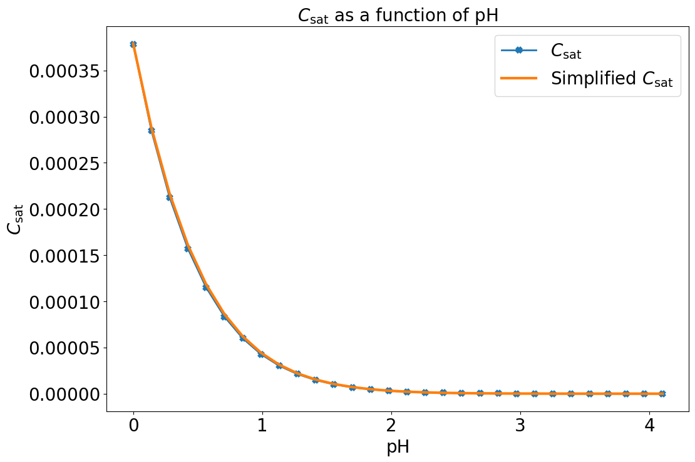 Simplified C_sat Function</td>
<td>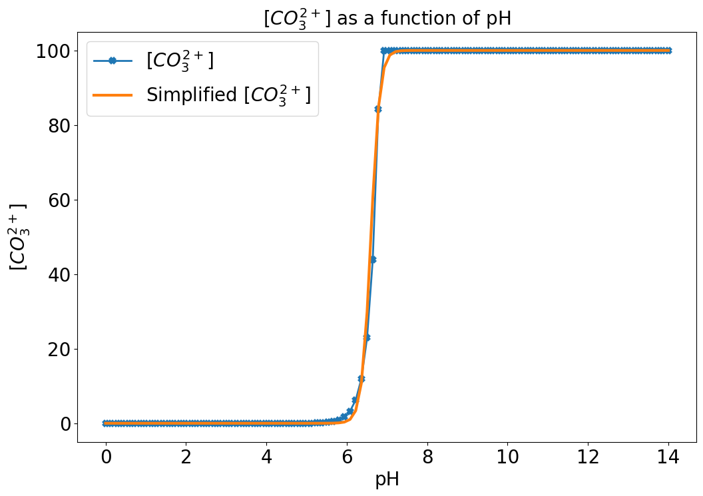 Simplified CO3^2- Function</td>
</tr></table>

**Figure 1:** Comparison between original C_sat, CO3^2- functions and their simplified versions. Here blue stared curve shows the original functions as described in the equations, while the orange curve shows the respective simplified versions.

---

## Experimental Data

### Raw Experimental Data
<table><tr>
<td> Experimental Data</td>
</tr></table>

**Figure 3:** Experimental measurements of Ca^2+ measured using two different sensor devices, IC (green) and ISE (orange). The measurements are observed in response to the pH changes induced either by adding NaOH solution or CO2 gas. The resulting pH profile (after scaling by a factor of 0.01) is shown in blue.

---

## Manual Method Results

### Manual Parameter Fitting (Experiments 1-4)
<table><tr>
<td> Manual Exp 1</td>
<td>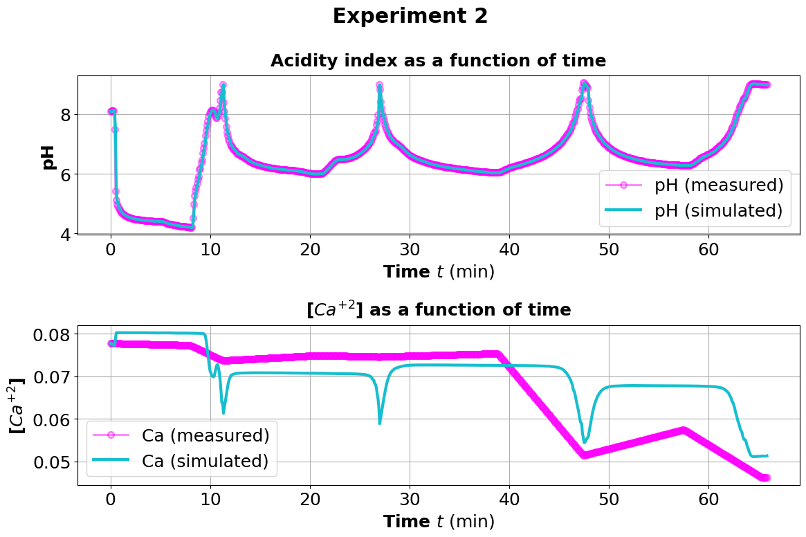 Manual Exp 2</td>
</tr></table>
<table><tr>
<td>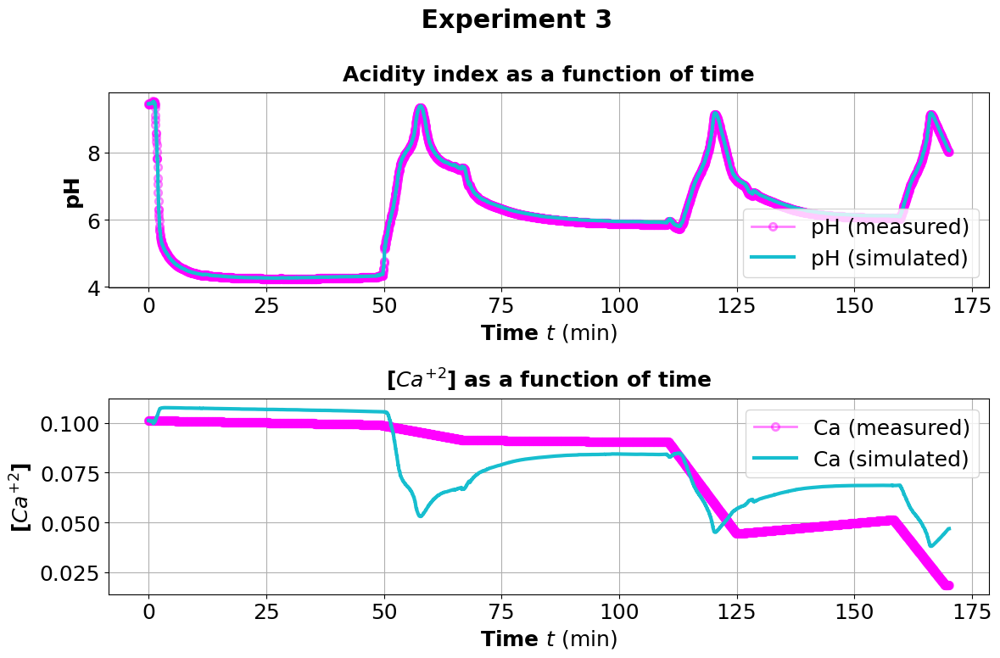 Manual Exp 3</td>
<td>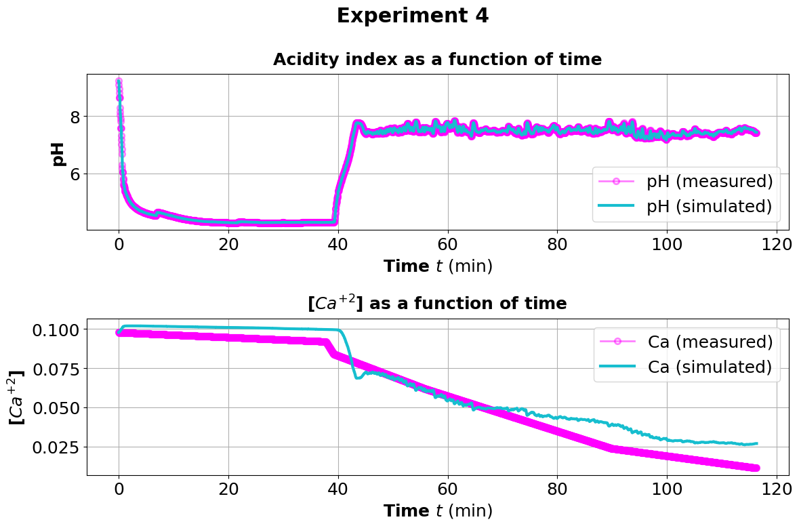 Manual Exp 4</td>
</tr></table>

**Figure 4:** Concentration of calcium ions as per the manually determined function U_r with experiment specific constants as mentioned in the corresponding table.

---

## FBSDE Method Results

### Forward-Backward SDE Results (Experiments 1-4)
<table><tr>
<td> FBSDE Exp 1</td>
<td>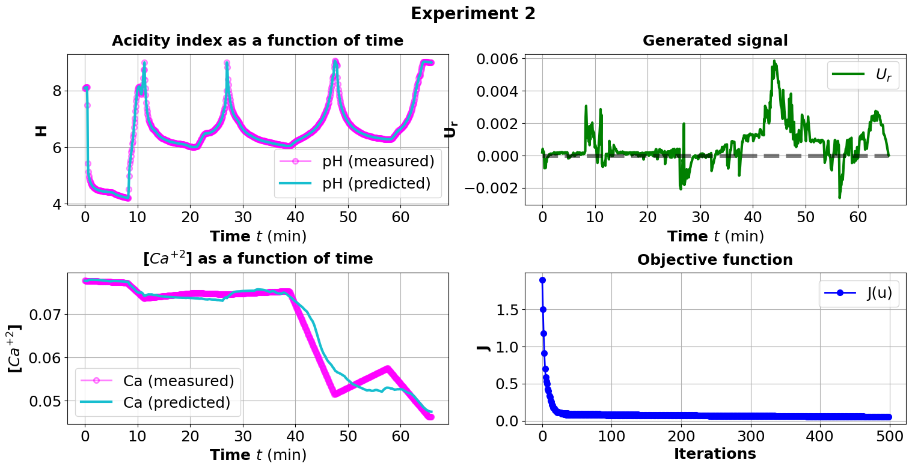 FBSDE Exp 2</td>
</tr></table>
<table><tr>
<td>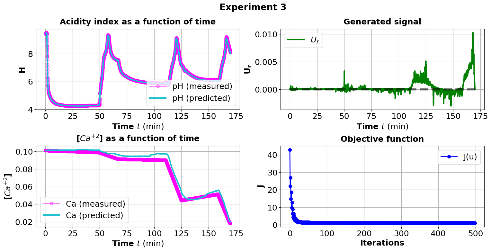 FBSDE Exp 3</td>
<td>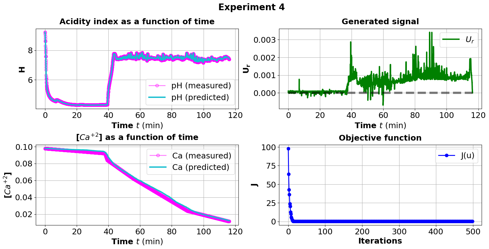 FBSDE Exp 4</td>
</tr></table>

**Figure 5:** Optimal design function U_r obtained after running the Algorithm for 500 iterations for each of the four experimental data trajectory separately. For each experimental plot, we see 4 subplots which are arranged from top-left to bottom-right in the following manner: the input function pH, the approximated or generated signal U_r, observable function Q ([Ca^2+]) and the objective function J(U_r). In each of the plots the raw experimental data trace is shown in magenta color.

---

## ANN Method Results

### Artificial Neural Network Results (Experiments 1-4)
<table><tr>
<td>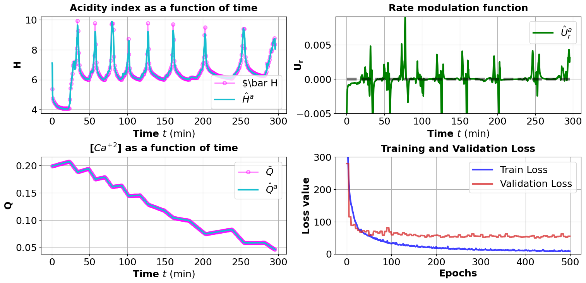 ANN Exp 1</td>
<td>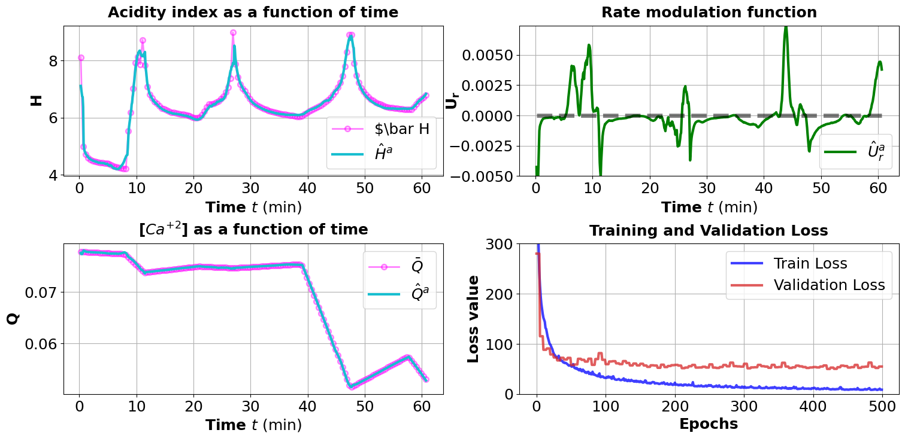 ANN Exp 2</td>
</tr></table>
<table><tr>
<td>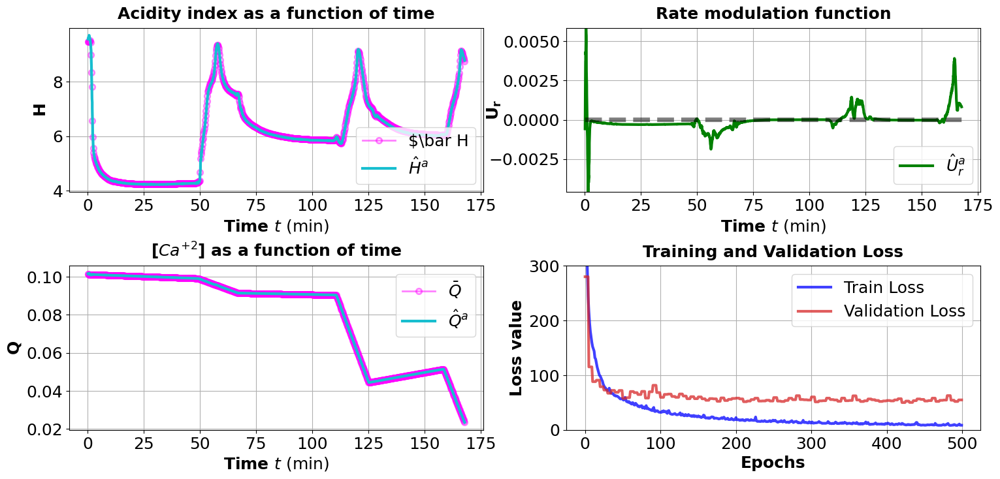 ANN Exp 3</td>
<td>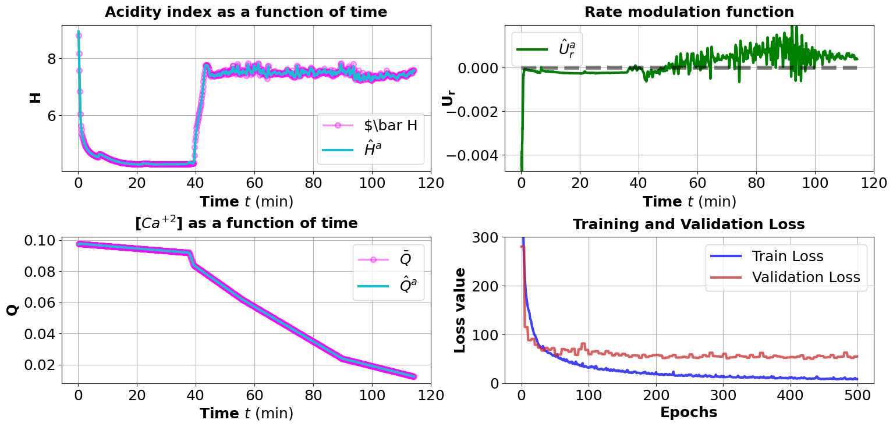 ANN Exp 4</td>
</tr></table>

**Figure 6:** Prediction results of the ANN model on the entire dataset.

---

## GRU Method Results

### Gated Recurrent Unit Results (Experiments 1-4)
<table><tr>
<td> GRU Exp 1</td>
<td>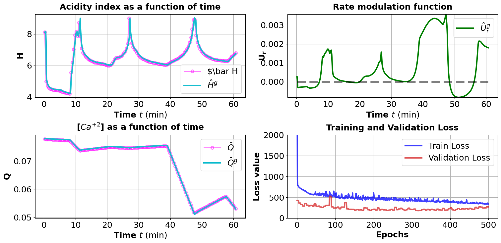 GRU Exp 2</td>
</tr></table>
<table><tr>
<td> GRU Exp 3</td>
<td>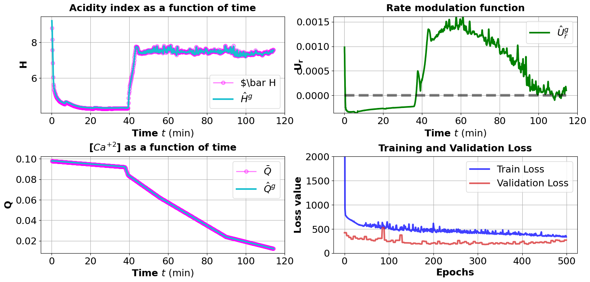 GRU Exp 4</td>
</tr></table>

**Figure 7:** Prediction results of the GRUN model on the entire dataset.

---

## Sequential vs Batch Comparison

### Training Method Comparison
<table><tr>
<td>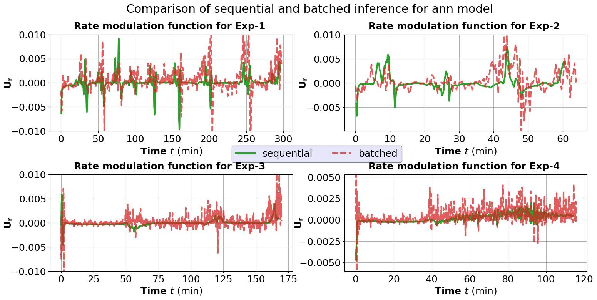 ANN: Sequential vs Batch</td>
<td>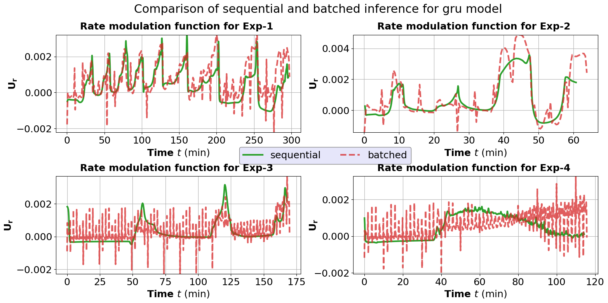 GRU: Sequential vs Batch</td>
</tr></table>

**Figure 8:** Comparison of the design function generated U_r generated by ANN and GRUN. Both models have generated smoother functions for the rolling window sequence while for the batched sequences the predicted signal has relatively higher oscillations.

---

## Model Comparison

### Method Comparison (Experiments 1 and 4)
<table><tr>
<td>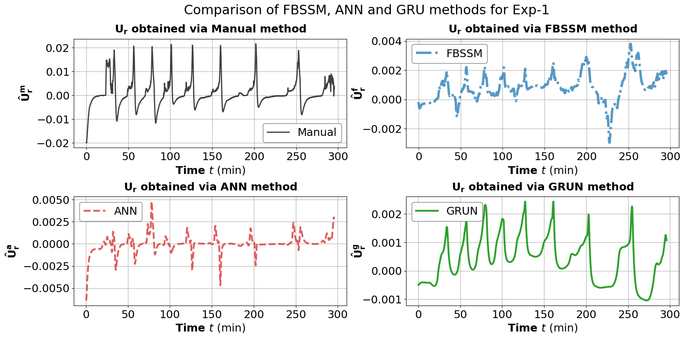 Comparison Exp 1</td>
<td> Comparison Exp 4</td>
</tr></table>

**Figure 9:** Comparison of predicted design function U_r by four different methods namely- manual, FBSSM, ANN and GRUN for experiment data 1 (top figure) and 4 (bottom figure). The GRUN model generates a smoother signal compared to the others, with less fluctuations and lower magnitude of min and max values.

---

## State Evolution Comparison

### State Variables Evolution (Experiment 1)
<table><tr>
<td>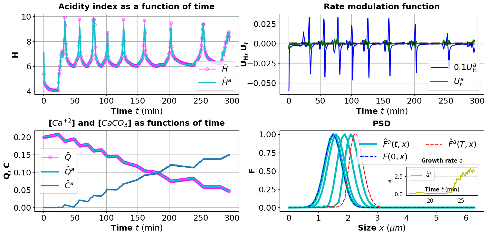 ANN State Evolution</td>
<td>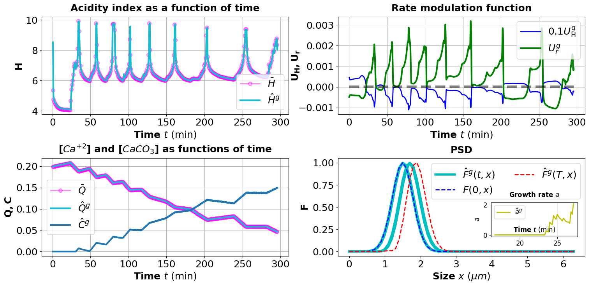 GRU State Evolution</td>
</tr></table>

**Figure 10:** Plots of the state variables of the system resulting from U_r obtained by ANN (left) and GRUN (right) model, respectively, for Experiment 1. The decrease in Ca^2+ is accompanied by the corresponding increase in CaCO3 in aqueous phase. As a consequence, growth of precipitated solids takes place which is depicted by the shift in PSD function F towards the higher particle size. The ANN model produces faster growth compared to GRUN model.